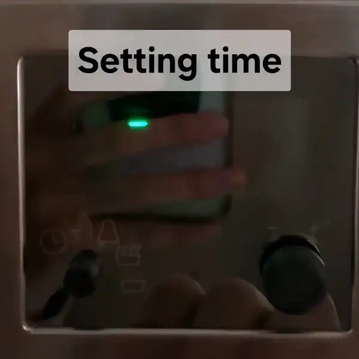
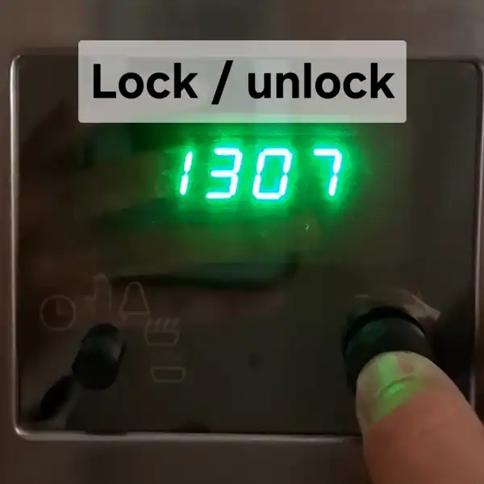
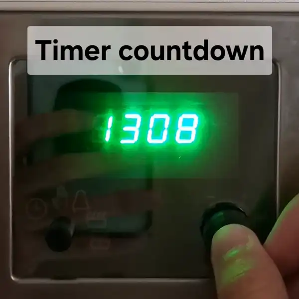
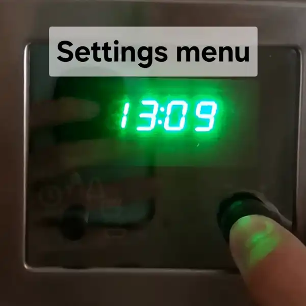
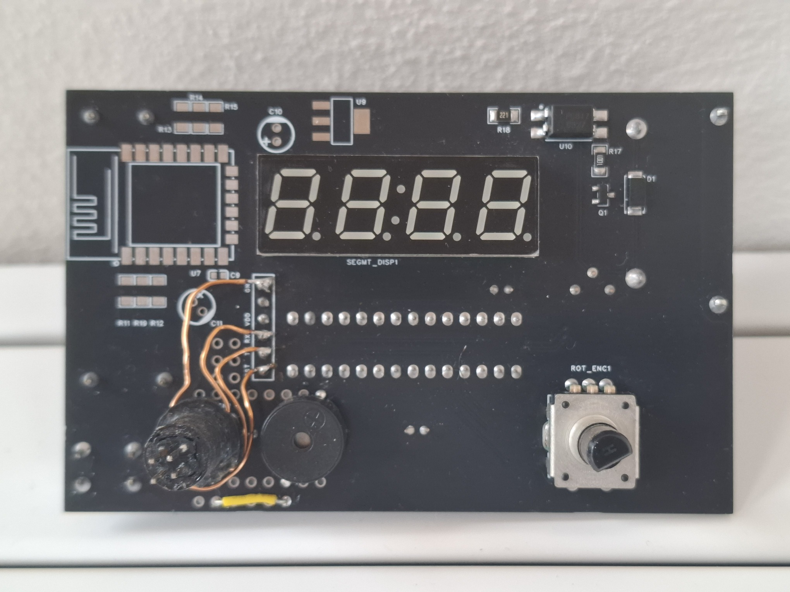
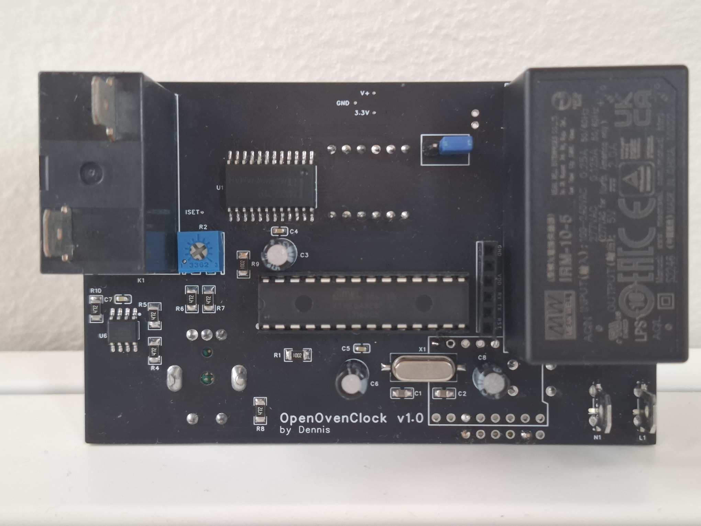
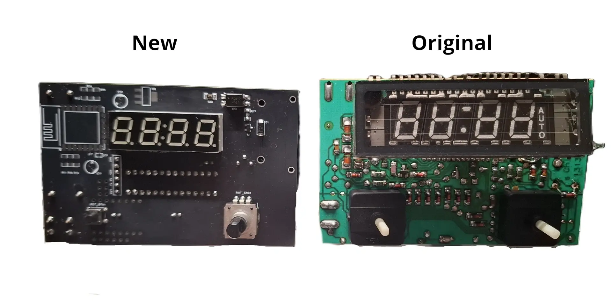

  

# OpenOvenClock
An open-source oven timer project - and my first custom PCB design.

## Quick background
My oven's timer suddenly broke completely, producing an annoying loud noise whenever power was applied. After a teardown and some failed repair attempts on its badly worn PCB, it became clear that fixing it was not practical. Instead, I used this as an opportunity to design and manufacture my own PCB, adding some quality-of-life upgrades to the original timer design.

## Features & improvements
The new timer supports most of the original features including:
- 24-hour format time display.
- Time set screen with improved flow, in the form of button confirmation, instead of time based advance from hours to minutes.
- Countdown baking timer.

As well as several additions to the original design. More specifically:

- Rotary encoder with integrated switch. Supports single, double and long press inputs.
- Eco (night) mode. When enabled the display dims during the night.
- Configurable display brightness.
- Setting to disable optional buzzer sounds.
- Automatic locking after specific time.
- User friendly animations, that improve usability.
- Watchdog implementation in case of malfunction, defaulting in locked mode (disabled oven) after reset.
- Settings menu.
- Easily accessible reset button, with integrated hidden serial interface.

Some of this functionality can be seen below:

|
:-------------------------------:|:-------------------------:
|

## Installation guide
In order to compile the firmware sketch for the ATmega328P, the Arduino IDE is required, as well as some 3rd party libraries.
### Libraries used:
- [LedControl](https://github.com/wayoda/LedControl) for communicating with the MAX7219.
- [DS3231](https://github.com/NorthernWidget/DS3231) for interfacing with the DS3231 RTC.
- [Switch](https://github.com/avdwebLibraries/avdweb_Switch) for rotary switch button de-bounce and multiple input type distinction.
- (Pre-installed) [Wire](https://docs.arduino.cc/language-reference/en/functions/communication/wire/) for I2C communication.
- (Pre-installed) [EEPROM](https://docs.arduino.cc/learn/built-in-libraries/eeprom/) for saving settings to the ATmega's EEPROM.
- (Pre-installed) [avr/wdt.h]() for implementing the watchdog timer.

After compiling the firmware sketch we need to flash it to the ATmega328P. For this guide we assume the use of the <b>FTDI FT232RL USB-to-Serial adapter</b>. In order for this adapter to function properly, it is required that the correct drivers are installed. This installation process is explained in great detail in this [guide](https://support.arduino.cc/hc/en-us/articles/4411305694610-Install-or-update-FTDI-drivers).

The final requirement for uploading the firmware, is an ATmega328P chip, that has a bootloader configured for using an external 16Mhz crystal, already burned. If such chip is unavailable, burning a bootloader is a relatively easy process by following the steps described in this [guide](https://support.arduino.cc/hc/en-us/articles/4841602539164-Burn-the-bootloader-on-UNO-Mega-and-classic-Nano-using-another-Arduino).

At this point, we are ready to proceed with the firmware flashing process. This process is described in the following steps:

1. Connect the USB-to-Serial adapter to the OpenOvenTimer board's serial port header.
2. Connect the USB-to-Serial adapter to an available USB port on the machine where Arduino IDE is installed.
3. Select the appropriate serial communication port inside Arduino IDE, when it appears.
4. Ensure the Serial Monitor window is closed, as it will in many cases interfere with the upload process.
5. Click the upload button and wait for the firmware flash process to complete.
6. Finally, click the reset button to get the micro-controller running on the new firmware.

## PCB design summary
During the PCB design process, several key challenges arose, the most important being the selection of devices that could reliably work together, to implement the desired functionality.

Some of the these choices are outlined below:

- When searching for a suitable micro-controller IC, the <b>ATmega328P-PN</b> variant was chosen, which provides slightly higher operating temperature margin, than the PU.
- For keeping track of time, the <b>DS3231 RTC</b> was selected. This IC provides more than adequate timekeeping functionality for this application, with an accuracy of ±3.5ppm until +85°C.
- A 4-digit 7-segment display is used, driven by a <b>MAX7219</b> IC. This display was selected as it was specifically made to support time format and the segments are green LEDs, that beautifully match the look of the original timer's VFD display.
- In order to include the auto baking functionality, a relay was added to switch the oven's loads (heaters, fan motors, etc). The selection process of an appropriate relay was tricky, as an oven consumes a lot of power. The original PCB used a relay that included quick-connect contacts. This eliminated the requirement for PCB traces that can handle large current.
 Taking these parameters into account, the <b>OMRON G4A-1A-E-DC5</b> relay was chosen. It provides a slightly higher contact current rating, while keeping the required coil voltage at 5V (instead of the original relay's 28V).
- For supplying power, a 5V PCB PSU module was selected, to save space and reduce complexity.

Board front side           |  Board back side
:-------------------------:|:-------------------------:
|

## Firmware design
While developing the firmware, a state machine architecture was used to ensure determinism. 

